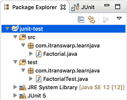
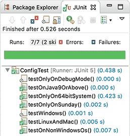
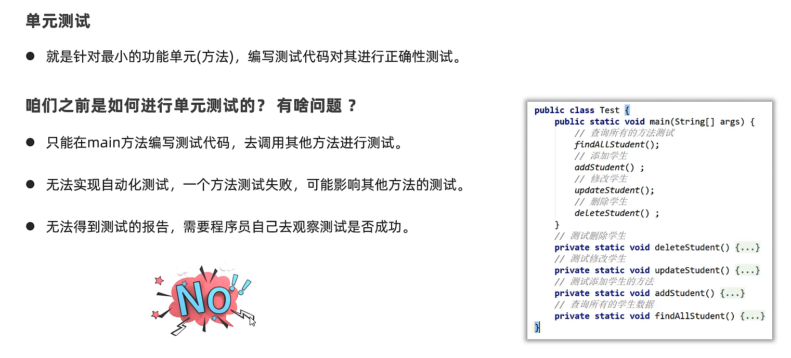
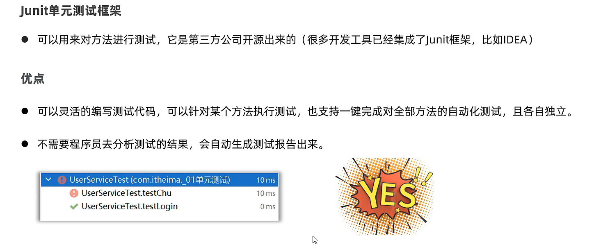
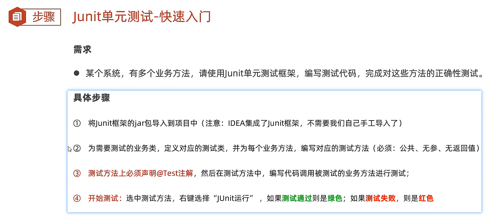
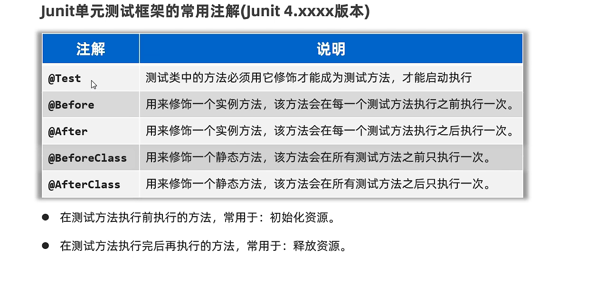

# 廖雪峰教程

[编写JUnit测试 - 廖雪峰的官方网站 (liaoxuefeng.com)](https://www.liaoxuefeng.com/wiki/1252599548343744/1304048154181666)

更详细请看[JUnit - 概述_w3cschool](https://www.w3cschool.cn/junit/fegu1hv3.html)


## 编写JUnit测试

什么是单元测试呢？单元测试就是针对最小的功能单元编写测试代码。Java程序最小的功能单元是方法，因此，对Java程序进行单元测试就是针对单个Java方法的测试。

单元测试有什么好处呢？在学习单元测试前，我们可以先了解一下测试驱动开发。

所谓测试驱动开发，是指先编写接口，紧接着编写测试。编写完测试后，我们才开始真正编写实现代码。在编写实现代码的过程中，一边写，一边测，什么时候测试全部通过了，那就表示编写的实现完成了：

```ascii
    编写接口
     │
     ▼
    编写测试
     │
     ▼
┌─> 编写实现
│    │
│ N  ▼
└── 运行测试
     │ Y
     ▼
    任务完成
```

这就是传说中的……


当然，这是一种理想情况。大部分情况是我们已经编写了实现代码，需要对已有的代码进行测试。

我们先通过一个示例来看如何编写测试。假定我们编写了一个计算阶乘的类，它只有一个静态方法来计算阶乘：

�!=1×2×3×...×�*n*!=1×2×3×...×*n*

代码如下：

```
public class Factorial {
    public static long fact(long n) {
        long r = 1;
        for (long i = 1; i <= n; i++) {
            r = r * i;
        }
        return r;
    }
}
```

要测试这个方法，一个很自然的想法是编写一个`main()`方法，然后运行一些测试代码：

```
public class Test {
    public static void main(String[] args) {
        if (fact(10) == 3628800) {
            System.out.println("pass");
        } else {
            System.out.println("fail");
        }
    }
}
```

这样我们就可以通过运行`main()`方法来运行测试代码。

不过，使用`main()`方法测试有很多缺点：

一是只能有一个`main()`方法，不能把测试代码分离，二是没有打印出测试结果和期望结果，例如，`expected: 3628800, but actual: 123456`，三是很难编写一组通用的测试代码。

因此，我们需要一种测试框架，帮助我们编写测试。

### JUnit

JUnit是一个开源的Java语言的单元测试框架，专门针对Java设计，使用最广泛。JUnit是事实上的单元测试的标准框架，任何Java开发者都应当学习并使用JUnit编写单元测试。

使用JUnit编写单元测试的好处在于，我们可以非常简单地组织测试代码，并随时运行它们，JUnit就会给出成功的测试和失败的测试，还可以生成测试报告，不仅包含测试的成功率，还可以统计测试的代码覆盖率，即被测试的代码本身有多少经过了测试。对于高质量的代码来说，测试覆盖率应该在80%以上。

此外，几乎所有的IDE工具都集成了JUnit，这样我们就可以直接在IDE中编写并运行JUnit测试。JUnit目前最新版本是5。

以Eclipse为例，当我们已经编写了一个`Factorial.java`文件后，我们想对其进行测试，需要编写一个对应的`FactorialTest.java`文件，以`Test`为后缀是一个惯例，并分别将其放入`src`和`test`目录中。最后，在`Project` - `Properties` - `Java Build Path` - `Libraries`中添加`JUnit 5`的库：


整个项目结构如下：



我们来看一下`FactorialTest.java`的内容：

```
package com.itranswarp.learnjava;

import static org.junit.jupiter.api.Assertions.*;
import org.junit.jupiter.api.Test;

public class FactorialTest {

    @Test
    void testFact() {
        assertEquals(1, Factorial.fact(1));
        assertEquals(2, Factorial.fact(2));
        assertEquals(6, Factorial.fact(3));
        assertEquals(3628800, Factorial.fact(10));
        assertEquals(2432902008176640000L, Factorial.fact(20));
    }
}
```

核心测试方法`testFact()`加上了`@Test`注解，这是JUnit要求的，它会把带有`@Test`的方法识别为测试方法。在测试方法内部，我们用`assertEquals(1, Factorial.fact(1))`表示，期望`Factorial.fact(1)`返回`1`。`assertEquals(expected, actual)`是最常用的测试方法，它在`Assertion`类中定义。`Assertion`还定义了其他断言方法，例如：

- `assertTrue()`: 期待结果为`true`
- `assertFalse()`: 期待结果为`false`
- `assertNotNull()`: 期待结果为非`null`
- `assertArrayEquals()`: 期待结果为数组并与期望数组每个元素的值均相等
- ...

运行单元测试非常简单。选中`FactorialTest.java`文件，点击`Run` - `Run As` - `JUnit Test`，Eclipse会自动运行这个JUnit测试，并显示结果：


如果测试结果与预期不符，`assertEquals()`会抛出异常，我们就会得到一个测试失败的结果：


在Failure Trace中，JUnit会告诉我们详细的错误结果：

```
org.opentest4j.AssertionFailedError: expected: <3628800> but was: <362880>
	at org.junit.jupiter.api.AssertionUtils.fail(AssertionUtils.java:55)
	at org.junit.jupiter.api.AssertEquals.failNotEqual(AssertEquals.java:195)
	at org.junit.jupiter.api.AssertEquals.assertEquals(AssertEquals.java:168)
	at org.junit.jupiter.api.AssertEquals.assertEquals(AssertEquals.java:163)
	at org.junit.jupiter.api.Assertions.assertEquals(Assertions.java:611)
	at com.itranswarp.learnjava.FactorialTest.testFact(FactorialTest.java:14)
	at java.base/jdk.internal.reflect.NativeMethodAccessorImpl.invoke0(Native Method)
	at ...
```

第一行的失败信息的意思是期待结果`3628800`但是实际返回是`362880`，此时，我们要么修正实现代码，要么修正测试代码，直到测试通过为止。

使用浮点数时，由于浮点数无法精确地进行比较，因此，我们需要调用`assertEquals(double expected, double actual, double delta)`这个重载方法，指定一个误差值：

```
assertEquals(0.1, Math.abs(1 - 9 / 10.0), 0.0000001);
```

### 单元测试的好处

单元测试可以确保单个方法按照正确预期运行，如果修改了某个方法的代码，只需确保其对应的单元测试通过，即可认为改动正确。此外，测试代码本身就可以作为示例代码，用来演示如何调用该方法。

使用JUnit进行单元测试，我们可以使用断言（`Assertion`）来测试期望结果，可以方便地组织和运行测试，并方便地查看测试结果。此外，JUnit既可以直接在IDE中运行，也可以方便地集成到Maven这些自动化工具中运行。

在编写单元测试的时候，我们要遵循一定的规范：

一是单元测试代码本身必须非常简单，能一下看明白，决不能再为测试代码编写测试；

二是每个单元测试应当互相独立，不依赖运行的顺序；

三是测试时不但要覆盖常用测试用例，还要特别注意测试边界条件，例如输入为`0`，`null`，空字符串`""`等情况。

## 使用Fixture

在一个单元测试中，我们经常编写多个`@Test`方法，来分组、分类对目标代码进行测试。

在测试的时候，我们经常遇到一个对象需要初始化，测试完可能还需要清理的情况。如果每个`@Test`方法都写一遍这样的重复代码，显然比较麻烦。

JUnit提供了编写测试前准备、测试后清理的固定代码，我们称之为Fixture。

我们来看一个具体的`Calculator`的例子：

```
public class Calculator {
    private long n = 0;

    public long add(long x) {
        n = n + x;
        return n;
    }

    public long sub(long x) {
        n = n - x;
        return n;
    }
}
```

这个类的功能很简单，但是测试的时候，我们要先初始化对象，我们不必在每个测试方法中都写上初始化代码，而是通过`@BeforeEach`来初始化，通过`@AfterEach`来清理资源：

```
public class CalculatorTest {

    Calculator calculator;

    @BeforeEach
    public void setUp() {
        this.calculator = new Calculator();
    }

    @AfterEach
    public void tearDown() {
        this.calculator = null;
    }

    @Test
    void testAdd() {
        assertEquals(100, this.calculator.add(100));
        assertEquals(150, this.calculator.add(50));
        assertEquals(130, this.calculator.add(-20));
    }

    @Test
    void testSub() {
        assertEquals(-100, this.calculator.sub(100));
        assertEquals(-150, this.calculator.sub(50));
        assertEquals(-130, this.calculator.sub(-20));
    }
}
```

在`CalculatorTest`测试中，有两个标记为`@BeforeEach`和`@AfterEach`的方法，它们会在运行每个`@Test`方法前后自动运行。

上面的测试代码在JUnit中运行顺序如下：

```
for (Method testMethod : findTestMethods(CalculatorTest.class)) {
    var test = new CalculatorTest(); // 创建Test实例
    invokeBeforeEach(test);
        invokeTestMethod(test, testMethod);
    invokeAfterEach(test);
}
```

可见，`@BeforeEach`和`@AfterEach`会“环绕”在每个`@Test`方法前后。

还有一些资源初始化和清理可能更加繁琐，而且会耗费较长的时间，例如初始化数据库。JUnit还提供了`@BeforeAll`和`@AfterAll`，它们在运行所有@Test前后运行，顺序如下：

```
invokeBeforeAll(CalculatorTest.class);
for (Method testMethod : findTestMethods(CalculatorTest.class)) {
    var test = new CalculatorTest(); // 创建Test实例
    invokeBeforeEach(test);
        invokeTestMethod(test, testMethod);
    invokeAfterEach(test);
}
invokeAfterAll(CalculatorTest.class);
```

因为`@BeforeAll`和`@AfterAll`在所有`@Test`方法运行前后仅运行一次，因此，它们只能初始化静态变量，例如：

```
public class DatabaseTest {
    static Database db;

    @BeforeAll
    public static void initDatabase() {
        db = createDb(...);
    }
    
    @AfterAll
    public static void dropDatabase() {
        ...
    }
}
```

事实上，`@BeforeAll`和`@AfterAll`也只能标注在静态方法上。

因此，我们总结出编写Fixture的套路如下：

1. 对于实例变量，在`@BeforeEach`中初始化，在`@AfterEach`中清理，它们在各个`@Test`方法中互不影响，因为是不同的实例；
2. 对于静态变量，在`@BeforeAll`中初始化，在`@AfterAll`中清理，它们在各个`@Test`方法中均是唯一实例，会影响各个`@Test`方法。

大多数情况下，使用`@BeforeEach`和`@AfterEach`就足够了。只有某些测试资源初始化耗费时间太长，以至于我们不得不尽量“复用”时才会用到`@BeforeAll`和`@AfterAll`。

最后，注意到每次运行一个`@Test`方法前，JUnit首先创建一个`XxxTest`实例，因此，每个`@Test`方法内部的成员变量都是独立的，不能也无法把成员变量的状态从一个`@Test`方法带到另一个`@Test`方法。

## 异常测试

在Java程序中，异常处理是非常重要的。

我们自己编写的方法，也经常抛出各种异常。对于可能抛出的异常进行测试，本身就是测试的重要环节。

因此，在编写JUnit测试的时候，除了正常的输入输出，我们还要特别针对可能导致异常的情况进行测试。

我们仍然用`Factorial`举例：

```
public class Factorial {
    public static long fact(long n) {
        if (n < 0) {
            throw new IllegalArgumentException();
        }
        long r = 1;
        for (long i = 1; i <= n; i++) {
            r = r * i;
        }
        return r;
    }
}
```

在方法入口，我们增加了对参数`n`的检查，如果为负数，则直接抛出`IllegalArgumentException`。

现在，我们希望对异常进行测试。在JUnit测试中，我们可以编写一个`@Test`方法专门测试异常：

```
@Test
void testNegative() {
    assertThrows(IllegalArgumentException.class, new Executable() {
        @Override
        public void execute() throws Throwable {
            Factorial.fact(-1);
        }
    });
}
```

JUnit提供`assertThrows()`来期望捕获一个指定的异常。第二个参数`Executable`封装了我们要执行的会产生异常的代码。当我们执行`Factorial.fact(-1)`时，必定抛出`IllegalArgumentException`。`assertThrows()`在捕获到指定异常时表示通过测试，未捕获到异常，或者捕获到的异常类型不对，均表示测试失败。

有些童鞋会觉得编写一个`Executable`的匿名类太繁琐了。实际上，Java 8开始引入了函数式编程，所有单方法接口都可以简写如下：

```
@Test
void testNegative() {
    assertThrows(IllegalArgumentException.class, () -> {
        Factorial.fact(-1);
    });
}
```

上述奇怪的`->`语法就是函数式接口的实现代码，我们会在后面详细介绍。现在，我们只需要通过这种固定的代码编写能抛出异常的语句即可。

## 条件测试

在运行测试的时候，有些时候，我们需要排出某些`@Test`方法，不要让它运行，这时，我们就可以给它标记一个`@Disabled`：

```
@Disabled
@Test
void testBug101() {
    // 这个测试不会运行
}
```

为什么我们不直接注释掉`@Test`，而是要加一个`@Disabled`？这是因为注释掉`@Test`，JUnit就不知道这是个测试方法，而加上`@Disabled`，JUnit仍然识别出这是个测试方法，只是暂时不运行。它会在测试结果中显示：

```
Tests run: 68, Failures: 2, Errors: 0, Skipped: 5
```

类似`@Disabled`这种注解就称为条件测试，JUnit根据不同的条件注解，决定是否运行当前的`@Test`方法。

我们来看一个例子：

```
public class Config {
    public String getConfigFile(String filename) {
        String os = System.getProperty("os.name").toLowerCase();
        if (os.contains("win")) {
            return "C:\\" + filename;
        }
        if (os.contains("mac") || os.contains("linux") || os.contains("unix")) {
            return "/usr/local/" + filename;
        }
        throw new UnsupportedOperationException();
    }
}
```

我们想要测试`getConfigFile()`这个方法，但是在Windows上跑，和在Linux上跑的代码路径不同，因此，针对两个系统的测试方法，其中一个只能在Windows上跑，另一个只能在Mac/Linux上跑：

```
@Test
void testWindows() {
    assertEquals("C:\\test.ini", config.getConfigFile("test.ini"));
}

@Test
void testLinuxAndMac() {
    assertEquals("/usr/local/test.cfg", config.getConfigFile("test.cfg"));
}
```

因此，我们给上述两个测试方法分别加上条件如下：

```
@Test
@EnabledOnOs(OS.WINDOWS)
void testWindows() {
    assertEquals("C:\\test.ini", config.getConfigFile("test.ini"));
}

@Test
@EnabledOnOs({ OS.LINUX, OS.MAC })
void testLinuxAndMac() {
    assertEquals("/usr/local/test.cfg", config.getConfigFile("test.cfg"));
}
```

`@EnableOnOs`就是一个条件测试判断。

我们来看一些常用的条件测试：

不在Windows平台执行的测试，可以加上`@DisabledOnOs(OS.WINDOWS)`：

```
@Test
@DisabledOnOs(OS.WINDOWS)
void testOnNonWindowsOs() {
    // TODO: this test is disabled on windows
}
```

只能在Java 9或更高版本执行的测试，可以加上`@DisabledOnJre(JRE.JAVA_8)`：

```
@Test
@DisabledOnJre(JRE.JAVA_8)
void testOnJava9OrAbove() {
    // TODO: this test is disabled on java 8
}
```

只能在64位操作系统上执行的测试，可以用`@EnabledIfSystemProperty`判断：

```
@Test
@EnabledIfSystemProperty(named = "os.arch", matches = ".*64.*")
void testOnlyOn64bitSystem() {
    // TODO: this test is only run on 64 bit system
}
```

需要传入环境变量`DEBUG=true`才能执行的测试，可以用`@EnabledIfEnvironmentVariable`：

```
@Test
@EnabledIfEnvironmentVariable(named = "DEBUG", matches = "true")
void testOnlyOnDebugMode() {
    // TODO: this test is only run on DEBUG=true
}
```

当我们在JUnit中运行所有测试的时候，JUnit会给出执行的结果。在IDE中，我们能很容易地看到没有执行的测试：



带有⊘标记的测试方法表示没有执行。

## 参数化测试

如果待测试的输入和输出是一组数据： 可以把测试数据组织起来 用不同的测试数据调用相同的测试方法

参数化测试和普通测试稍微不同的地方在于，一个测试方法需要接收至少一个参数，然后，传入一组参数反复运行。

JUnit提供了一个`@ParameterizedTest`注解，用来进行参数化测试。

假设我们想对`Math.abs()`进行测试，先用一组正数进行测试：

```
@ParameterizedTest
@ValueSource(ints = { 0, 1, 5, 100 })
void testAbs(int x) {
    assertEquals(x, Math.abs(x));
}
```

再用一组负数进行测试：

```
@ParameterizedTest
@ValueSource(ints = { -1, -5, -100 })
void testAbsNegative(int x) {
    assertEquals(-x, Math.abs(x));
}
```

注意到参数化测试的注解是`@ParameterizedTest`，而不是普通的`@Test`。

实际的测试场景往往没有这么简单。假设我们自己编写了一个`StringUtils.capitalize()`方法，它会把字符串的第一个字母变为大写，后续字母变为小写：

```
public class StringUtils {
    public static String capitalize(String s) {
        if (s.length() == 0) {
            return s;
        }
        return Character.toUpperCase(s.charAt(0)) + s.substring(1).toLowerCase();
    }
}
```

要用参数化测试的方法来测试，我们不但要给出输入，还要给出预期输出。因此，测试方法至少需要接收两个参数：

```
@ParameterizedTest
void testCapitalize(String input, String result) {
    assertEquals(result, StringUtils.capitalize(input));
}
```

现在问题来了：参数如何传入？

最简单的方法是通过`@MethodSource`注解，它允许我们编写一个同名的静态方法来提供测试参数：

```
@ParameterizedTest
@MethodSource
void testCapitalize(String input, String result) {
    assertEquals(result, StringUtils.capitalize(input));
}

static List<Arguments> testCapitalize() {
    return List.of( // arguments:
            Arguments.of("abc", "Abc"), //
            Arguments.of("APPLE", "Apple"), //
            Arguments.of("gooD", "Good"));
}
```

上面的代码很容易理解：静态方法`testCapitalize()`返回了一组测试参数，每个参数都包含两个`String`，正好作为测试方法的两个参数传入。

 如果静态方法和测试方法的名称不同，@MethodSource也允许指定方法名。但使用默认同名方法最方便。

另一种传入测试参数的方法是使用`@CsvSource`，它的每一个字符串表示一行，一行包含的若干参数用`,`分隔，因此，上述测试又可以改写如下：

```
@ParameterizedTest
@CsvSource({ "abc, Abc", "APPLE, Apple", "gooD, Good" })
void testCapitalize(String input, String result) {
    assertEquals(result, StringUtils.capitalize(input));
}
```

如果有成百上千的测试输入，那么，直接写`@CsvSource`就很不方便。这个时候，我们可以把测试数据提到一个独立的CSV文件中，然后标注上`@CsvFileSource`：

```
@ParameterizedTest
@CsvFileSource(resources = { "/test-capitalize.csv" })
void testCapitalizeUsingCsvFile(String input, String result) {
    assertEquals(result, StringUtils.capitalize(input));
}
```

JUnit只在classpath中查找指定的CSV文件，因此，`test-capitalize.csv`这个文件要放到`test`目录下，内容如下：

```
apple, Apple
HELLO, Hello
JUnit, Junit
reSource, Resource
```


# 黑马

[01、Java高级：junit单元测试框架详解_哔哩哔哩_bilibili](https://www.bilibili.com/video/BV1Cv411372m?p=191&vd_source=c2f66e44a79f69191225ba8e481487ee)









例子：


引出断言机制：


可以一键运行所有测试





